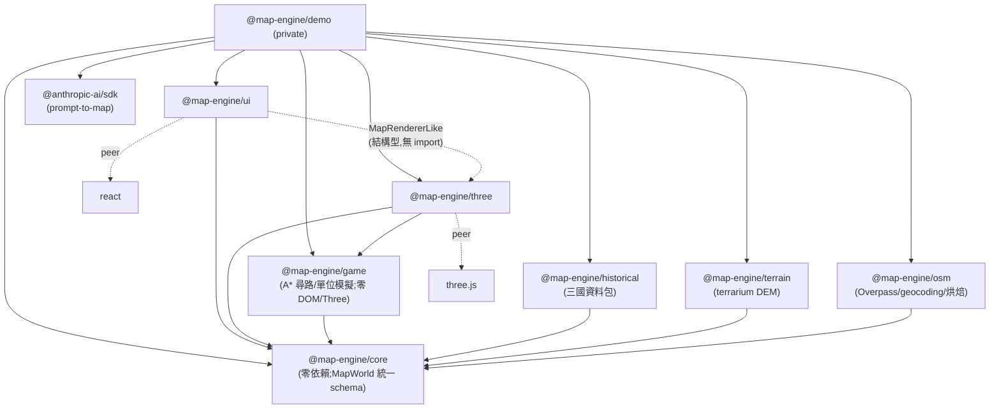
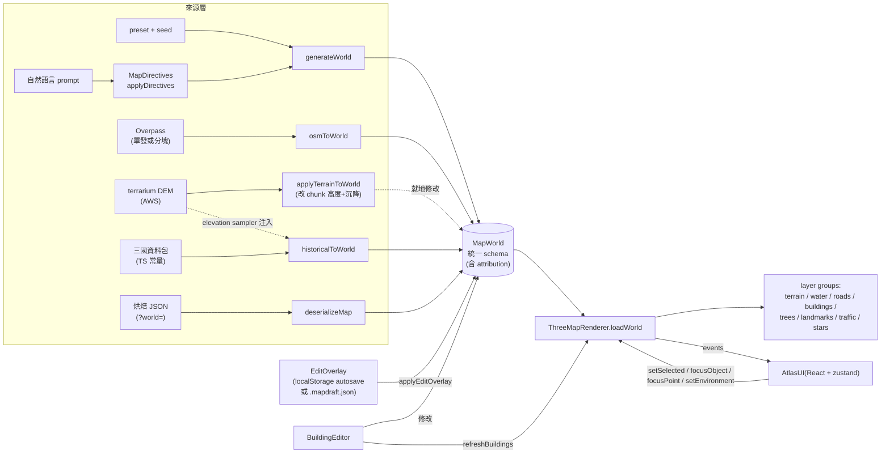

# 3D Map Engine 開發交接文檔

> 交接對象:後續接手的 AI Agent / 開發者
> 撰寫依據:2026-07-05 ~ 07-06 從零構建整個引擎的實際開發過程(git 歷史逐 commit 對應)
> 原始需求文檔:`3D Map Engine Plan.zip` 內的 `3d-map-engine-plan-v2-zh-Hant.md`(在 repo 根目錄,已 gitignore)
> 配套文檔:`map-data-sources-research.md`(多來源選型調研)· `packages/demo/public/developer-guide.html`(給人類的技術手冊,隨 demo 部署)
> Live demo:https://gordonlinghk.github.io/3d-map-engine/ (三國地圖:`?map=three-kingdoms`)
> Repo:https://github.com/gordonlinghk/3d-map-engine

---

## 1. 專案背景與目標

### 1.1 用途

一個**可重用的多來源 3D 地圖引擎**(Web / Three.js / TypeScript),不是遊戲、不是 GIS。同一個渲染管線消費四類世界:程序生成城市、OSM 真實城市(任意城市可搜尋)、預烘焙大範圍世界、歷史戰略地圖(首張:三國中國)。產出形式:

- 可嵌入其他 Web 應用或遊戲原型的 **SDK**(monorepo 內以 `workspace:*` 消費;npm 發佈基建已就緒但**刻意擱置**,見 §7.4)
- 一個可在瀏覽器操作的 **3D atlas demo**(GitHub Pages 自動部署)
- 可序列化/反序列化的**地圖資料格式**(JSON-safe;`MapWorld` 是所有來源的統一 schema)

### 1.2 核心功能範圍(全部已實作)

| 功能塊 | 內容 |
|---|---|
| 程序生成 | seed 決定一切;3 個 preset;地形、道路網、~2000 棟建築、地標、樹木 |
| 互動 | Orbit / Fly / Walk(Walk 含碰撞)、raycast 選取、高亮、focus 飛行、`focusPoint` 任意座標跳轉 |
| Demo UI | 模糊搜尋(⌘K)、列表 + chips + **即時文字過濾**、資訊面板、工具列、**可點擊跳轉的迷你地圖**、HUD |
| 環境 | Day / Golden Hour / Night(shadow、夜窗、街燈、星空;**霧距按世界尺寸縮放**)、Tour、圖層開關 |
| 模擬層 | 車沿道路圖行駛、渡輪、飛機 |
| Prompt-to-map | 自然語言 → MapDirectives → MapConfig;Claude API(用戶自帶 key)+ 本地關鍵詞 fallback |
| OSM 真實城市 | **任意城市搜尋**(Photon geocoding + AREA 1×/2×/3×)+ 4 個精選;Overpass(單發/分塊)→ MapWorld |
| 真實高程 | terrarium DEM → chunk 高度;建築沉降、湖床壓平、**海面自動出現**(維港);城市與歷史地圖通用 |
| 大範圍烘焙 | `pnpm bake` CLI:分塊限速抓取(≤8km)→ MapWorld JSON;demo `?world=<url>` 載入 |
| 歷史地圖 | `?map=three-kingdoms`:戰略尺度(1 unit=1km)三國中國;~50 考據城池(confidence 三級+出處)、勢力、古河道、要道;**勢力範圍地形著色**(`District.color` → terrainMesh 染色)+ **年份切換**(`?era=y194\|y200\|y208\|y219\|y229\|y264` 六個 era 快照,見 §2 C3/C4) |
| 編輯器 | 拖曳移動、樓高、旋轉、增刪、undo/redo、localStorage autosave、匯出 JSON——對全部世界類型可用 |
| 草稿檔 | `.mapdraft.json` 可攜帶續編草稿(overlay+base 配方/快照);FSA 覆寫存檔;跨機器 |

### 1.3 接手前必須理解的前提(硬性規則)

1. **`@map-engine/core` 絕對不可依賴 Three.js、React 或 DOM。** 純資料與生成邏輯。這是整個架構的地基。
2. **所有程序生成必須 deterministic**:同 seed + config 永遠產生 byte 級相同的世界。生成路徑禁 `Math.random()` / `Date.now()`,一律經 `createRng(seed)` 及其 `fork(label)`。(網絡來源——OSM/DEM——的世界以「烘焙/快照凍結」達成可重現。)
3. **渲染 mesh 不屬於核心資料模型。** `MapWorld` 只有資料;`@map-engine/three` 把資料變成可視物件。**任何新資料來源的本質工作 = 寫一個 `X → MapWorld` 轉換器**,渲染層零改動(osm/terrain/historical 三個包都是這個模式)。
4. **所有可互動物件必須有穩定 `id` + metadata**(程序 `bldg:{i},{j}:{li},{lj}`、OSM `bldg:osm:{wayId}`、用戶 `bldg:user:{n}`、歷史 `city:{map}:{cityId}`)。
5. **每完成一個階段都要有可運行 demo + 測試**,優先可操作成果,不做過度抽象。
6. Demo 用**真實公司公開資料**(文字,無 logo)——用戶明確授權的決定。
7. **資料授權紅線**(詳見 `map-data-sources-research.md`):Google/Mapbox/HERE 的 ToS **禁止**「抓取→轉自有格式→保存」,不可接入;CHGIS **禁止再散布**,只可作查證參考;開放資料的署名義務經 `world.attribution` 欄位落實(SidePanel 自動渲染,勿繞過)。歷史資料一律帶 confidence(attested/inferred/stylized)與出處,**不把推測當史實**。

---

## 2. 從零構建的完整步驟

> 以下按實際開發順序(= git commit 順序)。每步的「驗證」欄位是當時實際執行的驗證方式。

### Phase 1:專案骨架

- **目的**:monorepo + 工具鏈 + 空 Three.js 場景,建立「每步皆可驗證」的基礎。
- **做了什麼**:pnpm workspace(`packages/core|three|ui|demo`,後續增 `osm|terrain|historical|game`)、TypeScript project references(`tsconfig.base.json` + 各包 composite tsconfig)、ESLint flat config、Vitest、Playwright(desktop 1440×900 / large 1920×1080 / mobile 390×844 三個 project)、Vite + React demo 顯示空場景 + FPS。
- **關鍵細節**:
  - 各 library package 的 `main`/`exports` **直接指向 `src/index.ts`**——開發期由 Vite/Vitest 直接編譯源碼,無 build step。發佈欄位由 `publishConfig` 在 pack 時替換(見 B8)。
  - pnpm 11 會攔截依賴的 build scripts:`pnpm-workspace.yaml` 需要 `allowBuilds: { esbuild: true }`。
- **易錯點**:此環境的 preview 面板(corepack 路徑)可能 EPERM,視覺驗證一律走 Playwright 截圖腳本(見 §5.6)。
- **驗證**:`pnpm typecheck && pnpm lint && pnpm build`;e2e `smoke.spec.ts`(FPS 非零、canvas 可見)。

### Phase 2:核心資料與 seeded 生成

- **目的**:確立 determinism 地基。
- **做了什麼**:`core/src/rng.ts`(mulberry32 + xmur3 字串雜湊)、`noise.ts`(value noise + fBm,純函數)、`types.ts`(全部核心型別)、`presets.ts`、`serialize.ts`(版本檢查 + `structuredClone` 隔離)。
- **關鍵細節**:**`rng.fork(label)` 是順序無關的**——`fork('chunk/3,-2')` 的流只取決於 (seed, label),不受父流已消費多少影響。這是「chunk 生成不依賴順序」的實現機制。
- **驗證**:單元測試——同 seed 同序列、fork 順序無關性、序列化 roundtrip 深比較、JSON stringify/parse 存活。

### Phase 3:地形、水域與道路

- **目的**:第一個可看的世界。
- **做了什麼**:`core/terrain.ts`(`createHeightSampler`:fBm + 各 preset 的大尺度遮罩——coastal 用對角線大陸遮罩 + 海灣高斯挖除 + 灣中島嶼高斯凸起;island 徑向衰減;downtown 平台)、`core/roads.ts`(市區格網 + 跨圖高速線,水上段自動成 `bridge`,並有 per-preset 跨灣線)、`core/world.ts`(`generateWorld`/`generateChunk`,chunk 32 分辨率高度網格)、`three/terrainMesh.ts`(高度帶頂點色 + flatShading)、`waterMesh.ts`、`roadMesh.ts`(quad strip 沿地形,merged geometry)。
- **易錯點(實際踩過)**:
  - **道路三角形繞向錯誤 → 面朝下被 backface culling 整批剔除**,看起來像「道路完全不渲染」。修正繞向並加 `side: DoubleSide` 保險。
  - 深海角落 chunk 的高度被 clamp 成常數,「不同 seed 地形不同」的測試必須比較**中央** chunk。
  - 道路格網範圍與街區範圍必須同源:`cityGridExtent(config)`(roads.ts 導出,city.ts 引用)。
- **驗證**:單元測試(land ratio、road graph 連通、序列化)+ 三個 preset 俯視截圖逐一目檢。

### Phase 4:建築與地標

- **做了什麼**:`core/companies.ts`(28 家真實 SF 公司資料)、`core/city.ts`(街區分類 → 分 lot 生成建築 → 高度按離市中心衰減 → 公司分配到最高辦公樓;地標:金門橋/Alcatraz/Sutro Tower/Coit Tower/Oracle Park/Ferry Building;樹木散佈)、`three/buildingsMesh.ts`(**4 個高度等級各一個 InstancedMesh**,程序生成 CanvasTexture 窗戶貼圖)、`treesMesh.ts`(instanced)、`landmarksGroup.ts`(手工低模)。
- **易錯點**:吊橋纜索用 CatmullRom 會過衝成波浪,改**三段 QuadraticBezier**;球場 ExtrudeGeometry 的旋轉/平移順序容易弄反。
- **驗證**:建築數量測試(>1200)、每物件有 id/name/position/type、chunk objectIds 不重複;近景截圖對照參考圖。

### Phase 5:互動控制

- **做了什麼**:`three/cameraRig.ts`(orbit=OrbitControls;fly=drag-look + WASD/QE/Shift + 滾輪調速;walk=pointer lock + 貼地 + focus tween)、`three/interaction.ts`(instanced picking:`instanceId` → id 映射;高亮)、`three/events.ts`(型別化 emitter),renderer 整合 click/dblclick/Esc/hover 節流。
- **關鍵細節**:**rig 在 `setMode('walk'|'fly')` 時才從 camera quaternion 同步 yaw/pitch**。程式化控制相機朝向必須「先 lookAt、再 setMode」——反過來會被 pointer lock 的合成 pointermove 用舊角度覆蓋(CI 實際踩過,見 §5.5)。
- **驗證**:e2e——WASD 位移、投影座標點擊選樓開面板、Esc 清除、focusObject 飛近地標。

### Phase 6:Demo UI

- **做了什麼**:`@map-engine/ui` 全部元件(SearchBar/SidePanel/InfoPanel/Toolbar/MiniMap/Hud/AtlasUI)+ zustand store + Fuse.js 搜尋。**UI 透過結構型介面 `MapRendererLike` 使用 renderer,不 import three package**(structural typing,`ThreeMapRenderer` 自動滿足)。
- **易錯點**:頁面出現第二個 canvas(迷你地圖)後,所有 e2e 的 `locator('canvas')` 都要 `.first()`。
- **驗證**:e2e——搜尋 Cloudflare/AI/Landmark、chips 過濾、列表點擊同步選取。

### Phase 7:環境模式與巡覽

- **做了什麼**:三種環境的完整光照/霧/天空/水色;夜間窗戶=night CanvasTexture 作 emissiveMap;`three/tour.ts`;浮動 label(`projectToScreen`);圖層開關面板。
- **驗證**:e2e——背景色隨環境改變、tour 移動相機、圖層開關隱藏 group;夜景/黃昏截圖目檢。

### Phase 8:驗收、優化、部署

- **做了什麼**:視覺回歸(canvas 像素變異數 > 閾值)、UI 區塊不重疊檢查、mobile 佈局(側欄預設收起);GitHub Actions:`deploy.yml`(test job:typecheck+lint+unit+e2e desktop/mobile → deploy job:`DEPLOY_BASE=/3d-map-engine/` build → Pages)。
- **易錯點**:Pages deploy 可能暫時性失敗(“try again later”,本項目發生過 3 次);**同一 run 重跑會產生兩個同名 artifact 而再失敗——正確做法是 `gh workflow run` 觸發全新 run**。
- **驗證**:CI 綠 + live URL 截圖。

### 後續迭代(按序):A3 → B9 → C10 → B5 → A2 → A4 → B8 → B7 → B6 → B10 → B11 → B12 → B13 →(數據來源調研)→ A5 → B14 → B15 → C1 → C2 → C3 → C4 → C5 → C6 → C7

| 代號 | 內容 | 關鍵檔案 | 一句話要點 |
|---|---|---|---|
| A3 | 街區著色 | `types.ts`(`CityBlock` 進 `MapWorld.blocks`)、`terrainMesh.ts` | 地形頂點按所屬街區 kind 上色,公園綠塊 |
| B9 | 模擬層 | `three/simulation.ts` | 車=InstancedMesh 沿 road graph 邊 polyline;路口隨機轉向;渡輪 pier↔island;圖層 id `traffic` |
| C10 | 首頁化 | `Toolbar.tsx`(World 面板)、`App.tsx`(載入畫面)、`index.html`(OG tags) | preset/seed UI、loading overlay、1200×630 OG 圖 |
| B5 | Prompt-to-map | `core/directives.ts`、`demo/promptToMap.ts` | LLM 只輸出 `MapDirectives`,`applyDirectives` clamp;無 key 走本地關鍵詞解析;結果進 URL `cfg`(base64url)/`env` |
| A2 | 視覺質感 | `renderer.ts`(shadow)、`waterMesh.ts`(normal map 動畫)、`streetLights.ts`、`sky.ts` | PCFSoft 2048 shadow map;**quality 機制**(見 §5.2) |
| A4 | Walk 碰撞 | `three/collision.ts`、`cameraRig.ts` | 2D AABB spatial hash(cell 48)、逐軸解算=沿牆滑行、海面阻擋、head bob |
| B8 | npm 基建 | 各包 `tsup.config.ts`/`tsconfig.build.json`/`publishConfig`、`release.yml` | 建置驗證過、**實際發佈擱置**(用戶決定) |
| B7 | OSM | `packages/osm/*`、`buildingsMesh.ts`(多邊形路徑)、`flatAreas.ts` | 見 §6.4 |
| B6 | 編輯器 | `core/edits.ts`、`three/editor.ts`、`ui/EditorPanel.tsx` | 見 §6.5 |
| B10 | 草稿檔 | `core/draft.ts`、`demo/drafts.ts`、`App.tsx` boot | `.mapdraft.json` = overlay + base 配方(procedural 存 seed/directives、imported 內嵌快照);開檔 = sessionStorage 暫存(綁 URL、**保留不消費**,防 StrictMode double-mount)→ 導航 → boot 優先路徑 → `sanitizeOverlayForWorld` 漂移剔除 → 自動進編輯模式;存檔 FSA 覆寫(webdriver 一律下載) |
| B11 | 城市搜尋 | `osm/geocode.ts`、`ui/CitySearch.tsx`、`App.tsx` | `GeocodingProvider` 抽象(預設 Photon 免 key;**Nominatim 政策禁 autocomplete 故不用**;mock provider 供離線 `?geo=mock`)→ 候選 → `candidateToCityArea(c,{scale})` 裁剪成 1×/2×/3× 視窗(整城 extent 會炸 Overpass)→ URL `?bbox=s,w,n,e&cityName=`(`parseBBoxSlug` 校驗,每邊 ≤6.5km)→ 復用 Overpass 流程;UI:400ms debounce、≥2 字元、AbortController+序號防過時、cache、鍵盤↑↓Enter、AREA 選單;>1× 走 `fetchOsmAreaTiled` + 進度顯示;boot AbortController 貫穿取消(否則 StrictMode 棄置 boot 繼續背景抓磁磚);草稿 sourceSlug=`bbox:…` |
| B12 | 大範圍烘焙 | `osm/bake.ts`、`scripts/bake-city.ts`、`App.tsx` | `pnpm bake --city/--center/--bbox --size N`:`splitBBox`(≤1.2km 磁磚)→ `fetchOsmAreaTiled`(1.5s 間隔、5/15/45s backoff×3、支援 AbortSignal)→ `mergeOsmResponses`(type+id 去重,跨界 way 重複)→ `osmToWorld` → JSON;demo `?world=<url>` 載入(失敗退回程序生成),草稿 sourceSlug=`url:…`;>8km 拒絕(除非 --force)。**坑:Node fetch 無預設 UA → Overpass 406**,fetchOsmArea 已固定送 UA(瀏覽器忽略)。實測 3km 香港:3,153 棟/7.2MB/boot 1s |
| B13 | 列表過濾+小地圖跳轉 | `ui/SidePanel.tsx`、`ui/MiniMap.tsx`、`three/renderer.ts` | SidePanel 即時文字過濾(name/category、與 chip 疊加、✕/Esc 清除);renderer 新公開 `focusPoint({x,z}, radius?)`;MiniMap onClick 反算 px→世界 XZ。**坑:手機上 toolbar(z-26)攔截面板右緣點擊 → 面板開啟時 z-27** |
| — | 數據來源調研 | `map-data-sources-research.md` | 多來源選型(無代碼變更):商業 API ToS 全禁提取;CHGIS 禁再散布;三國可行路徑 = 人工資料包 + 真實 DEM。**用戶定案:A5 → B14** |
| A5 | 真實高程 | `packages/terrain/*`、`App.tsx`、`bake-city.ts`、`flatAreas.ts` | terrarium DEM(AWS 免 key,`h=R·256+G+B/256−32768`)→ `fetchElevationGrid`(zoom 按磁磚預算 ≤14、瀏覽器 canvas 解碼 / Node 注入 pngjs)→ `applyTerrainToWorld`:chunk 高度相對最低陸地、海(≤0.05m)→ −1.6 低於 waterLevel(**維港自動出現,v1 限制①③修復**)、水體下壓平湖床、建築沉至 footprint 最低點、道路節點重取樣(roadMesh/simulation/streetLights 自取樣自動跟隨);`world.attribution` 新 core 欄位 → SidePanel 渲染;`?flat=1`/`--flat` 退出、失敗退平地;**mock Overpass 的 e2e 必須 abort elevation route 防真網請求**。實測中環 −1.6~479.8m |
| B14 | 三國 MVP | `packages/historical/*`、`App.tsx`、`Toolbar.tsx`、`renderer.ts`(fog) | 戰略尺度 **1 unit=1km**;資料包 = TS 常量(~50 城 attested/inferred/stylized 三級 confidence + 出處;黃河走古北道);`historicalToWorld`:真實 DEM(垂直 ×0.012 誇張、海→−2)+ 風格化城池(主殿=可搜尋 entry、category=勢力名;**城牆 type 必須 residential 否則塞爆列表**)+ 河流 ribbon 分段 carve + 路線→roadGraph;URL `?map=` + Toolbar ⚔️ select;草稿 sourceSlug=`hist:…`;**坑:fog 距離按 half=800 城市世界調的 → `fogScale=max(1, half/800)`,3000-unit 世界否則全被霧吞** |
| C1 | 遊戲邏輯層 SDK | **新包 `packages/game/*`**(零 DOM/Three)、`three/gameView.ts`、`three/cameraRig.ts`+`renderer.ts`(鏡頭跟隨)、`demo/App.tsx`(`?game=1`)、`e2e/game.spec.ts` | **以多 agent workflow 交付**(Opus 寫 A*/模擬核心 + 鏡頭跟隨、Sonnet 寫 gameView 綁定 + demo/e2e、Haiku 全路徑 QA、獨立 clean-session Opus 終審);`@map-engine/game` = **A\* 尋路**(道路圖無向、cost=幾何 XZ 長度 → 直線啟發式 admissible/consistent → 最短路;二元堆積、tie-break 確定性)+ **單位模擬**(`tick(dt)` 沿路徑推進、貼地取樣、heading、事件 spawned/waypoint/arrived/removed;flush 具重入保護保證嚴格發射順序;全確定性)+ `buildGraphIndex`/`nearestNode`/`findPath`;`three/createGameView` = 每單位一 marker、每幀 tick sim + 同步、`followUnit`;**鏡頭跟隨**新增 `cameraRig.setFollowTarget` + `renderer.setFollowTarget`(update 分支序 tween > follow > orbit/free;**坑:follow 會關 orbit.enabled → setMode/goHome/focusOn 取消跟隨必須經 `stopFollow()` 還原,否則相機鎖死**——終審抓到並修);demo `?game=1` 全 gated(單位生在同一連通分量保證互可達,點地面 → lead 單位尋路);單元測試 23(pathfinding 10 + simulation 13) |
| C2 | 中式建築風格 | `core/types.ts`(`BuildingStyle`)、`historical/convert.ts`、`three/buildingsMesh.ts`+`interaction.ts`、`e2e/historical.spec.ts` | **多 agent workflow 交付**(Opus 核心幾何/Sonnet 視覺驗證+e2e/Haiku QA/獨立 Opus 終審);`BuildingInfo` 加**可選** `style?: 'modern'\|'chinese'`(additive,modern 無影響);三國城池主殿+城牆標 `style:'chinese'`;渲染關鍵設計:**chinese 建築改走合併多邊形 body 路徑**(暖牆無玻璃、經 faceRanges 可 pick——picker 免改)+ 疊加合併 **歇山/廡殿式屋頂 mesh**(`makeHipRoof`:base 依 w/d、脊沿長軸、DoubleSide 免管繞向、簷口外挑;方形退化為攢尖;瓦色青灰、牆色木紅/夯土;長條城牆按長寬比 gate 不加頂);night 由 poly 暖光沿用。**終審抓到並修的真 bug:屋頂高於牆身+外挑,只 raycast body → 點屋頂會 miss 反而取消選取(halls 本是可點方塊,屬回退)→ 給屋頂 mesh 也建 faceRanges 並將 picker 的 polyMesh 區塊抽成 `resolveMerged` 同時處理 body+roof**(獨立 Opus 複審 APPROVE)。 |
| B15 | POI 註記系統 | `core/edits.ts`(overlay v2)、`three/poisGroup.ts`+`editor.ts`、`ui/EditorPanel.tsx` | **首次以多 agent workflow 交付**(Opus 核心遷移/Sonnet 常規/Haiku QA/獨立 Opus 終審);`PoiInfo` + MapObject poi 變體 + 圖層 'pois';**EditOverlay v1→v2**(+addedPois/modifiedPois/deletedPois),`normalizeOverlay()` 讓舊 localStorage/草稿無損遷移(所有讀取入口必須經它);編輯器 📍 poiMode(與 addMode 互斥)、rename/icon/delete 全走 Command(undo/redo 自然生效)、`renderer.refreshPois()`;POI 進 entries(kind 'poi')可搜尋。**坑:zero-POI 世界不可 eager 建共享幾何(disposeObject 只釋放掛在 mesh 上的資源)** |
| C3 | 勢力著色 + 年份切換 | `core/types.ts`(`District.color`)、`three/terrainMesh.ts`、`historical/types.ts`(`HistoricalEra`)、`historical/convert.ts`、`historical/data/threeKingdoms.ts`(4 era)、`ui/Toolbar.tsx`(era select)、`demo/App.tsx`(`?era=`)、`e2e/historical.spec.ts` | `District` 加**可選** `color?: string`(additive,不設色的世界零影響);`terrainMesh.ts` 對海平面以上頂點,依所在有色 district 把顏色 `lerp` 0.45 朝其 `color`——重疊多邊形**按面積小到大排序**測試,保證飛地(小勢力嵌在大勢力邊界內)贏得染色;`historicalToWorld(data,{era})` 新增 `era` 選項:不傳/傳 `defaultEra`/傳未知 id 一律回退基準快照(`world.id='hist:three-kingdoms'`),傳合法 era id 則依該 era 的 `ownership`(cityId→factionId,`'neutral'` 合法)、`kindOverrides`、`nameOverrides` 重新賦權/改名/變更主殿風格,`world.id='hist:three-kingdoms:<eraId>'`;三國資料包新增 **4 個 era**:y200 官渡之戰(9 勢力)、y208 赤壁前夕(8 勢力)、y219 襄樊之戰後(4 勢力)、y229 三國鼎立(= 基準資料,預設);每個 era 的 ownership 為原始整理自正史,皆帶 `sources`。Demo:`?era=` URL 參數;Toolbar 📅 ERA `<select>`(`data-testid="era-select"`)只在歷史地圖且定義了 eras 時出現,選預設 era 會清空 `?era`;草稿 `sourceSlug` 內嵌 era(`hist:three-kingdoms:y200`),開檔還原對應 era。單元測試新增 `three/terrainMesh.test.ts`(6)+ historical 測試 7→29,基線變 141/16 檔;e2e 檔案數不變(仍 18 個 spec 檔)但 `historical.spec.ts` 測試數 3→6(era 切換 + 勢力著色)。 |
| C4 | 更多年代快照 | `historical/data/threeKingdoms.ts`(+2 era)、`historical/historical.test.ts`、`e2e/historical.spec.ts` | 三國資料包再新增 **2 個 era**,兩端各補一筆:**y194 群雄並起**(14 勢力——漢末最分裂的一幕,取興平元年年中之勢:陶謙、劉焉尚在世,孫策未渡江故揚州仍屬劉繇;洛陽自董卓西遷焚燒後為廢墟,與官渡、虎牢、武都同列無主)、**y264 蜀漢既亡**(2 勢力——蜀漢亡後、晉代魏前的二分之勢:曹魏盡吞益州,孫吳僅存江東荊南交廣;永安羅憲以魏巴東太守之名固守六月拒吳,吳師不能克,故白帝城歸魏,notes 中披露交趾當年名義仍歸吳、實已附魏的簡化取捨)。`THREE_KINGDOMS.eras` 現為 `[y194, y200, y208, y219, y229, y264]`,依年份嚴格遞增排列,`defaultEra` 仍為 `y229`。單元測試新增校驗「eras 按年份遞增」+ 194/264 兩端各一組 ownership 斷言,historical 測試 29→38,基線變 150/16 檔;e2e 檔案數不變(仍 18 個 spec 檔),`historical.spec.ts` 的 era-count 斷言 4→6。 |
| C5 | 中式建築 v2 — 翹角飛簷 | `three/buildingsMesh.ts`(`makeHipRoof`)、`three/buildingsMesh.test.ts`(新檔,14) | `makeHipRoof` 從 4 片平面拆成**曲面殼**:凹曲坡面 `y = rH·(1−t)^1.6`(舉折式,坡中點低於弦約 34%)疊加**四角翹起** `cornerLift = max(0.25, min(w,d)·0.18)`(smoothstep 沿簷邊 30% 範圍 + 向脊 t≤0.6 淡出,兩因子相乘保證簷邊中點貼原弦、角尖永不高過脊);簽名、簷口外挑範圍、脊高公式皆不變,方形 footprint 仍退化為攢尖(僅曲面化 + 翹角,C5 出街時三國 51 座主殿全方形,即全數出街為曲面攢尖+翹角;C6 起改長方出歇山脊);單棟 ~264 tris(較 v1 增加),51 頂約 13.5k tris;`faceRanges` 照舊由實際三角形數推導,picker 的 `resolveMerged` 免改,e2e `historical.spec.ts` 的 roofMapsToHall 續綠。新增 `buildingsMesh.test.ts`(14 tests:曲面單調性、翹角上限、方形退化、faceRanges 對應等)。單元測試基線 150/16 檔 → **164/17 檔**;e2e 不變(仍 18 個 spec 檔)。 |
| C6 | 中式建築 v3 — 重檐 + 斗栱帶 + 長方主殿歇山脊 | `core/types.ts`(`BuildingInfo.roofTiers`)、`historical/convert.ts`、`three/buildingsMesh.ts` + 測試 | `BuildingInfo` 加**可選** `roofTiers?: 1 \| 2`(additive,省略=1,2=重檐);歷史主殿 footprint 由正方改**長方**(面闊 `hallHalfW = style.size·0.22`,進深 `hallHalfD = style.size·0.15`,比例 ≈1.47,踩在 `isRoofEligible` 的 2.5 門檻之下)——C5 的曲面殼首次以非退化長方形出街,終於呈現真正的**歇山脊**而非攢尖;都城(era-resolved `kind==='capital'`,含 y200 官渡快照下的許昌)額外賦 `roofTiers: 2`。`buildingsMesh.ts` 對 `roofTiers===2` 的殿疊**重檐**:上檐 `makeHipRoof` 縮放 `UPPER_ROOF_SCALE=0.66`,簷面高度 = 下簷基 + 下簷脊高·`UPPER_EAVE_FRACTION=0.62`,兩檐之間補一段暖牆色收腰 `COLLAR_TINT='#8f4a3c'`(外擴 `COLLAR_MARGIN=0.08`);所有中式屋頂(單檐、重檐皆一體適用)另加**斗栱帶**:簷下木色環帶 `BAND_WOOD='#6b4a2f'`,高 `clamp(0.12, 0.3, ridge·0.1)`,外挑 = `overhang·0.4`。新增 `roofMetrics()` 從已生成的殿頂 geometry 讀回 `overhang`/`ridge`,而非重述 `makeHipRoof`(凍結未動)的內部公式,避免兩處代入公式互相漂移;每殿的下檐、斗栱帶、(重檐時)收腰、上檐、上斗栱帶依序 push 進同一 `geometries` 陣列,保持每殿三角形連續一段,`faceRanges`/picking 邏輯不變。單元測試 `buildingsMesh.test.ts` 14→21、`historical.test.ts` 38→40,單元測試基線 164/17 檔 → **173/17 檔**;e2e 不變(仍 18 個 spec 檔)。 |
| C7 | 遊戲層擴充 — 尋路權重 + 陣營戰鬥 + 單位選取 | `game/src/pathfinding.ts`(`EdgeCostFn`)、`game/src/simulation.ts`(戰鬥)、`three/src/gameView.ts`(`pickUnit`/`selectUnit`/選取環)、`demo/App.tsx`(`?game=1` v2)、`e2e/game.spec.ts` + 各自測試 | **以 fable-orchestrator workflow 交付**(Opus 寫 game SDK 核心即 Item A、Sonnet 寫單位選取層 + demo + e2e 即 Item B,每個 item 各自過 Haiku QA,orchestrator(Fable)本人在最後做全 diff 終審——列為 high-risk 因為全是公開 API 擴充)。三個子項全是**加法式公開 API**:①**尋路權重**——`buildGraphIndex(graph, options?: { edgeCost?: EdgeCostFn })`,`EdgeCostFn = (edge, from, to, baseCost) => number`;有效 cost = `max(回傳值, baseCost)`——**這個 clamp 是刻意設計**:任何邊都不可能比其幾何直線距離更便宜,才能保證直線 Euclidean 啟發式在加權後仍然 admissible,A\* 才維持最優解(結論:hook 只能讓邊更貴,想打折會被無聲 clamp 掉,不會悄悄弄壞 A\*);回傳 `Infinity` = 封路(該邊雙向從 adjacency 移除,如同不存在);`NaN`/負值回退 `baseCost`(防禦性,壞權重退化成幾何 cost 而非污染搜尋);`PathResult.cost` 相應變成加權總和;`GameSimulationOptions.edgeCost?` 貫穿到 `createGameSimulation` 內部的 `buildGraphIndex` 呼叫。②**陣營戰鬥**——`SpawnOptions` 加 `factionId?`/`hp?`(預設 100)/`attackDamage?`(預設每秒 10)/`attackRange?`(預設 8);`Unit` 對應加 `factionId: string \| null`(`null` = 非戰鬥單位,永不攻擊也永不被鎖定)、`hp`/`maxHp`/`attackDamage`/`attackRange`;`UnitState` 加 `'fighting'`;新事件 `unit:combat {attackerId, defenderId, damage}` 與 `unit:defeated {unitId, attackerId}`(緊接一個 `unit:removed`)。`tick(dt)` 拆成**三個固定順序 phase**保證戰鬥與移動一樣可重現:**① 鎖定**——用 tick 開始時的位置算,每個非中立單位找範圍內最近的敵方陣營單位,同距離時 id 較小者勝;**② 移動**——未鎖定敵人的單位照常移動,已鎖定的單位整 tick 暫停(路徑與 progress 原樣保留,`state`→`'fighting'`,靠 `preFightState` map 記住暫停前的狀態,解除鎖定後原樣恢復,而非用猜的);**③ 傷害**——先用 phase① 的鎖定結果算出每筆傷害,再一次性套用,故互相在射程內的兩個單位**可以同一 tick 互相殺死對方**(對稱結算),`hp<=0` 者本 tick 移除。一個 tick 內事件發射順序固定:移動事件(單位插入序)→ `unit:combat`(攻擊者插入序)→ 逐個陣亡單位(陣亡單位插入序)的 `unit:defeated`+`unit:removed` 配對。**坑(需知)**:只有本 tick 真的受傷的單位才會被判定陣亡——`unit:defeated` 的 `attackerId` 是必填欄位,一個生成時就 `hp<=0` 但沒人打它的單位會活著留在場上。③**單位選取**——`GameView` 加 `pickUnit(pointer): UnitId \| null`(客戶端像素座標→ NDC → 對單位 marker raycast,取最近命中,用一個 `THREE.Object3D → UnitId` 反查表把命中的子網格走 parent chain 對應回單位)、`selectUnit(id \| null)`、`getSelectedUnit()`;選取環是場景裡一個持久命名為 `'game:selection'` 的物件,每幀跟著被選單位位置更新,單位被移除時自動清除選取,`dispose()` 一併釋放其 geometry/material;`GameViewOptions.factionColors?: Record<string,string>` 讓 marker 顏色優先序變成 `factionColors[factionId] ?? KIND_COLORS[kind] ?? 預設色`。Demo `?game=1` 升級成 v2:紅方 `#c0392b`×3、藍方 `#2d7dd2`×3,在可達連通分量內盡量分散生成;**凍結不變量**——插入序最前兩個生成的單位永遠同陣營(demo 生成邏輯把前 3 個 pick 指派紅方、其餘藍方),這是為了不破壞 C1 就存在的舊 e2e(它把單位 0 移到單位 1 身上、預期抵達而非開戰);點單位 = 選取(顯示環),已有選取時點地面 = 命令該單位移動;紅藍雙方接觸會自動開戰。單元測試:`pathfinding.test.ts` 10→16、`simulation.test.ts` 13→25,game 包由 23→41,單元測試基線 173/17 檔 → **191/17 檔**;e2e `game.spec.ts` 1→4(新增選取/`pickUnit`/戰鬥三個測試),spec 檔案數不變(仍 18 個)。 |

---

## 3. 順序與依賴關係

### 3.1 必要先後順序

```
Phase 1 骨架 → Phase 2 RNG/資料 → Phase 3 地形/道路 → Phase 4 建築/地標
                                        ↘ Phase 5 互動(需要 picking 目標)
Phase 5 → Phase 6 UI(消費 renderer 事件) → Phase 7 環境/巡覽 → Phase 8 部署
後續:B7(OSM)是 B11/B12 的地基;A5(高程)是 B14(三國)的地基(真實地形)。
```

後續迭代大致獨立,但注意兩個「復用鏈」:B6(編輯器)復用了 B7 建立的多邊形建築渲染路徑(旋轉後的矩形 footprint 不再軸對齊 → 自動走 poly 管線);B14 復用了 A5 的 `fetchElevationGrid` 與 B12 的「快照凍結」思路。

### 3.2 模組依賴圖



**規律:資料來源包(osm/terrain/historical)只依賴 core、互不依賴**;需要組合時(例如三國 = historical + terrain 的 elevation sampler)由 demo/調用方注入函數,不建立包間依賴。**例外:`game` 是純邏輯層(只依賴 core、零 DOM/Three),但 `three` 直接依賴 `game`**——因為 `three/gameView.ts`(單位渲染 + 鏡頭跟隨)是 game 的 Three 綁定。純邏輯(A*/單位/事件)留在 game 可在 Node 單元測試,渲染綁定放 three,分工同 core↔three。

### 3.3 影響後續擴展的設計決策

| 決策 | 影響 |
|---|---|
| `createWorldHeightSampler` 從 **chunk 高度網格雙線性取樣**而非重算地形函數 | 任何來源的世界(程序/OSM/烘焙/歷史)道路、車流、Walk、地標朝向全部自動正確。**修改地形高度必須改 chunk heights,不能只改 sampler**(A5 的 `applyTerrainToWorld` 正是這樣做) |
| 建築渲染三分:`style:'chinese'` → 合併多邊形 body + 歇山屋頂(皆 faceRanges picking);軸對齊矩形 → InstancedMesh;任意多邊形 → 合併 ExtrudeGeometry + faceRanges | 新增建築形狀/風格不用動 picking(屋頂 mesh 亦帶 faceRanges,`interaction.resolveMerged` 統一解析);但**編輯建築後必須呼叫 `renderer.refreshBuildings()`**;新風格 = 在 buildingsMesh 加分支 + 讀 `BuildingInfo.style` |
| UI 用結構型 `MapRendererLike` / `BuildingEditorLike` / `CityCandidateLike` | 給 renderer/editor 加公開方法時,UI 若要用需同步擴充 `ui/src/types.ts` 的介面 |
| `MapLayerId` 是封閉 union(core/types.ts) | 新圖層要同時改:union、renderer `layerGroups`、ui `TOGGLABLE_LAYERS` + store `layers` 初始值 |
| 世界身份 = **URL 參數**(`seed/preset/cfg/env` \| `city` \| `bbox+cityName` \| `world` \| `map`),boot 依此分支 | 分享性好、狀態簡單;**新增世界類型 = boot 加一個分支 + 草稿 sourceSlug 前綴映射(`bbox:`/`url:`/`hist:`)+ SidePanel isImported 判斷**。切換世界必全頁重載 |
| 編輯以 **overlay**(modified/added/deleted)存,不存整個世界 | localStorage 體積小、同 seed 重生成可重放;**改了生成演算法會讓舊 overlay 的 modified 快照與新世界不一致**(快照直接覆蓋,通常可接受) |
| 草稿檔 base 二分:procedural 存配方、imported 內嵌快照 | 網絡來源(OSM/DEM)會漂移,快照凍結是唯一可靠重現方式;開檔時 `sanitizeOverlayForWorld` 剔除失效引用 |
| `world.attribution?: string[]`(core 可選欄位) | 資料來源的授權署名義務由資料層寫入、UI 層自動渲染;新來源接入時**必須**寫入其署名 |
| 世界尺度不固定:城市世界 1 unit=1m,戰略世界 1 unit=1km | 渲染層大多尺度無關,但**調過的常數要注意**:fog 距離已按 `fogScale=max(1, worldHalf/800)` 縮放;相機 far=6000;道路寬度/物件尺寸由資料層按尺度給 |
| 勢力著色 = 資料驅動 `District.color`,不是 renderer 特判 | 任何世界只要在 district 上填 `color` 就會被 `terrainMesh` 染色(smallest-area-first 保飛地),procedural/OSM 從不設色故零影響——新資料來源要「勢力範圍視覺化」直接複用,不用碰渲染代碼 |
| 年份切換 = **有限 era 快照**,不是逐年模擬 | `HistoricalEra` 是手工整理的完整 ownership 表(每城市每 era 都要覆蓋),不是規則引擎推導;好處是每筆都可標 `sources`、可審查;代價是「兩個快照之間」的年份無法內插,新增年份 = 新增一筆完整 era 資料 |

### 3.4 改 X 會牽動 Y 速查表

| 想改 | 會牽動 |
|---|---|
| `BuildingInfo` 欄位 | serialize 測試、`buildingsMesh`、`interaction.buildPickableIndex`、`collision`、`ui/entries`、`InfoPanel`、`editor`、OSM convert、historical convert |
| 地形形狀/preset | `terrain.ts` 遮罩、`world.test.ts` land-ratio 斷言、道路 `isLand` 判定、城市街區可建性、minimap 底圖 |
| chunk 高度(任何來源) | 一切自動跟隨(sampler 派生):道路、車流、街燈、Walk、minimap;但**建築/樹的 `position.y` 是存量資料,要主動重取樣**(參考 `applyTerrainToWorld` Pass 4) |
| 道路圖結構 | `roadMesh`、`simulation`(車)、`streetLights`、OSM convert、historical convert 的 route 映射、**`game` 的 A* 尋路(`buildGraphIndex`/`findPath`)** |
| renderer 公開 API | `ThreeMapRenderer` 介面、`ui/types.ts` 的 `MapRendererLike`、demo `__mapEngine` 消費者(e2e 大量使用);**新增公開方法後同步這三處**(如 C1 的 `setFollowTarget` 供 `gameView` 使用) |
| 環境模式 | `applyEnvironment`(光/霧/水色;注意 fogScale)、`buildingsMesh.setNightMode`、`streetLights`、`stars`、`landmarksGroup.userData.setNight`、ui `ENV_ORDER` |
| URL 參數 scheme | boot 分支順序(pendingDraft > map > world > city/bbox > procedural)、`drafts.ts` 的 sourceSlug↔URL 映射、`editsKey`(含 cfg)、分享連結相容性 |
| entries 收錄規則(`ui/entries.ts`) | 哪些建築進列表/搜尋:company metadata、type `public`、`imported`+tag `Named`。新來源的「可搜尋物件」要滿足其一;**不想進列表就避開這三者**(三國城牆用 type residential 的原因) |

---

## 4. 系統架構

### 4.1 技術棧

TypeScript 5.9 / Three.js 0.180(peer >=0.170)/ React 19 / Vite 7 / pnpm 11 workspace / Zustand 5 / Fuse.js 7 / Vitest 3 / Playwright 1.61 / tsup 8(發佈建置)/ @anthropic-ai/sdk(僅 demo)/ tsx + pngjs(僅 CLI 腳本,root devDeps)。

### 4.2 核心資料流



Demo boot 的世界解析優先序:**pendingDraft(sessionStorage)> `?map=`(歷史)> `?world=`(烘焙)> `?city=`/`?bbox=`(OSM,+高程)> 程序生成**。全部經同一個 `loadWorld`。

### 4.3 renderer 內部分工(`three/src/`)

| 模組 | 職責 |
|---|---|
| `renderer.ts` | 組裝一切:場景/光/霧(fogScale 按世界尺寸)、frame loop(dt clamp 0.1s)、環境切換、圖層、事件 emitter、公開 API(`loadWorld/pickObject/pickGround/focusObject/focusPoint/setSelected/refreshBuildings/projectToScreen/...`) |
| `cameraRig.ts` | 三模式相機 + focus tween(1.1s,dt 驅動)+ 鍵盤狀態 + 碰撞注入點 |
| `interaction.ts` | raycast picking(instanced + faceRanges)、hover/selected 高亮物件 |
| `collision.ts` | 純 TS 空間雜湊 AABB(可 node 單測) |
| `*Mesh.ts / *Group.ts / simulation.ts / sky.ts / flatAreas.ts` | 各圖層的幾何構建,皆為 `(world) => Object3D` 純構建函數;flatAreas 水面取輪廓最低點、綠地取平均 |
| `editor.ts` | 命令堆疊 + 拖曳 + overlay 追蹤(`getOverlay()` 供草稿/autosave) |
| `tour.ts` | 地標巡覽 |

---

## 5. 開發注意事項

### 5.1 效能

- 建築/樹/車全部 instancing;多邊形建築合併為單一 geometry(單 draw call)。實測上限:渋谷 2×(18,318 棟)可渲染。
- `loadWorld` / `refreshBuildings` 會 dispose 舊 geometry/material/texture(`disposeObject` 遍歷含 texture)。新增持有 GPU 資源的模組時**必須**接入 dispose 鏈。
- Shadow map 是最大 GPU 成本。用戶真機確認 60fps 無壓力;低端裝置可走 quality 'low'。

### 5.2 quality 機制(重要)

`createThreeMapRenderer({ quality: 'high'|'low' })`:low = 無陰影 + pixelRatio 1。Demo 判定:URL `?q=` 覆蓋 → 否則 `navigator.webdriver` 為 true 走 low。**起因:CI 軟件渲染跑 shadow pass 會卡死主線程,UI 互動全部超時。** 任何 headless 截圖想看陰影必須帶 `?q=high`。

### 5.3 3D 座標與幾何慣例

- 世界原點在地圖中心;北 = -Z(OSM/歷史投影 `y = -(lat-lat0)*scale` 與 minimap/指南針一致)。
- `Vec2.y` 在 footprint/boundary 語境代表**世界 Z**。
- Shape/Extrude 幾何:shape 用 `(x, -z)`,`rotateX(-PI/2)` 後 depth 變 +Y。
- 道路抬升 0.35 防 z-fighting;橋面 = waterLevel + 7;flat water/green 多邊形 +0.12/+0.06。
- 新 mesh 記得繞向(頂面朝上)或 `DoubleSide`——Phase 3 的道路隱形就是繞向反了。
- 尺度:城市世界 1 unit = 1 m;歷史戰略世界 1 unit = 1 km(垂直另有誇張係數)。寫尺寸常數前先確認在哪種世界。

### 5.4 資料結構與擴展

- 改 `MapWorld` 型別:優先加**可選欄位**(如 `waterPolygons?`、`attribution?`),序列化自動相容;`SERIALIZATION_VERSION` 只在破壞性變更時 bump。
- 手工構造 `MapWorld` 的測試 fixture(serialize.test / collision.test / terrain.test)在加**必填**欄位時會編譯失敗——這是刻意的提醒。
- 草稿格式(`core/draft.ts`)有獨立的 `DRAFT_VERSION`;改 `DraftBase`/overlay 結構時 bump 並在 `parseDraft` 保持舊版拒絕訊息可讀。

### 5.5 常見 bug 與排查(全部實際發生過)

| 症狀 | 原因 / 修法 |
|---|---|
| 某 mesh 完全看不到但資料正常 | 三角形繞向 → 被 culling。查 winding 或暫時 `DoubleSide` |
| 大世界整片被霧吞沒 | fog 距離按城市世界調的 → `applyEnvironment` 的 `fogScale=max(1, worldHalf/800)` 已處理;新環境參數記得乘 |
| CI e2e 大面積超時、本地全過 | CI 軟渲染 + shadow → 用 quality 機制;已設 `retries: 2` + 120s timeout(playwright.config) |
| 本地全套 e2e 偶發大片失敗(boot 15s 超時) | 本機 6 workers 並行 WebGL 過載 → `--workers=2` 全綠;CI 有自己的 worker 數與 retries |
| walk/fly 測試裡相機亂走 | headless pointer lock 行為不一:**先 lookAt 再 setCameraMode**,測試不要點 canvas(會觸發 pointer lock) |
| e2e 等待動畫後斷言位置錯(CI 慢機) | 相機 tween 是 dt 驅動且 dt clamp 0.1s,低 FPS 下牆鐘時間拉長 → **不要固定 waitForTimeout,`expect.poll` 等到達** |
| e2e 導航類操作 context destroyed / 舊頁面搶答 | 開草稿/選城市會異步導航,舊頁面也滿足 `__mapEngine` 等待條件 → **先 `page.waitForEvent('framenavigated')` 再等新引擎** |
| mock 了 Overpass 的測試仍發真網請求 | A5 之後城市載入會抓 elevation tiles → 每個 OSM mock 測試**都要** `route('**/elevation-tiles-prod/**', abort)`(走平地 fallback)或 fulfill fixture |
| Node 腳本呼叫 Overpass 得 406 | Node fetch 無預設 User-Agent,Overpass 拒絕 → `fetchOsmArea` 已固定送識別 UA(瀏覽器忽略此 forbidden header) |
| React StrictMode 下 boot 邏輯跑兩次的各種怪象 | double-mount:消費式讀取(sessionStorage 取後即刪)會令第二次 boot 拿不到 → 改「綁 URL、保留不消費」;異步抓取要用 boot AbortController 取消,否則棄置的 boot 繼續在背景抓資料並污染 loading 文案 |
| tsup `--dts` 報 TS6307 | composite tsconfig 衝突 → 各包有獨立 `tsconfig.build.json`(無 composite),tsup 指向它 |
| Pages deploy “try again later” / 兩個同名 artifact | 前者暫時性(已遇 3 次);重跑要用 `gh workflow run` 開新 run,不要 rerun --failed |
| e2e strict mode violation: 2 canvases | minimap 也是 canvas → `locator('canvas').first()` |
| 工具列蓋住右側面板按鈕 / 手機面板點不到 | `.atlas-toolbar.shifted`:selectedId **或** editMode 時 right:328px + top:64px;手機側欄開啟時 z-27 > toolbar z-26 |
| 列表被某來源的輔助建築塞爆 | `ui/entries.ts` 收錄規則(見 §3.4 末行)——輔助幾何(城牆等)用 type `residential` 避開 |
| headless FPS 只有 4-8 | 軟件渲染假象,不代表真機效能,別按它調優 |

### 5.6 視覺驗證工作流(無 preview 面板環境)

```bash
# 背景 dev server(用 run_in_background,收工記得 TaskStop)
pnpm dev
# 截圖:node --input-type=module 內 import { chromium } from '@playwright/test'
# 開 http://localhost:5173/?q=high(或 ?map=three-kingdoms&q=high)
# → page.evaluate 擺相機/選物件(window.__mapEngine)→ screenshot → Read 圖檔目檢
```

`window.__mapEngine = { renderer, world, tour, editor }` 是 demo 掛的除錯/測試鉤子,e2e 大量依賴,**不要移除**。

---

## 6. 後續擴展指南

### 6.1 新增一個程序生成 preset

1. `core/types.ts`:`MapPresetId` union 加名字。
2. `core/presets.ts`:加 `MapConfig`。
3. `core/terrain.ts`:switch 加該 preset 的大尺度遮罩(參考三個現有分支)。
4. (可選)`core/roads.ts` 加跨水線;`core/city.ts` 的 `districtCenterFor` 加市中心位置與地標分支。
5. demo `PRESETS` 陣列、Toolbar `PRESET_OPTIONS` 加項。
6. 驗證:`world.test.ts` 的「每個 preset 有陸有水」迴圈自動覆蓋;截圖目檢。

### 6.2 新增 3D 物件 / 圖層

1. `core/types.ts`:`MapLayerId` union 加 id;若是可互動物件,擴充 `MapObject` union(記得穩定 id)。
2. `three/` 新建 `xxxMesh.ts` 純構建函數;`renderer.loadWorld` 建立、`layerGroups.set`、加入 `worldRoot`、接 dispose。
3. 若可點選:進 `interaction.buildPickableIndex` + picker 目標。
4. `ui/store.ts` `TOGGLABLE_LAYERS` + `layers` 初始值。
5. 有動畫 → 提供 `update(dt)` 或 `userData.tick(t)`,在 renderer loop 呼叫(參考 simulation / water / beacon)。

### 6.3 修改視覺樣式

- 地形配色:`terrainMesh.ts` 高度帶 + `BLOCK_COLORS`;建築:`buildingsMesh.ts` 的 `FACADE_TINTS`/`POLY_TINTS` 與 `makeFacadeTexture`;環境:`renderer.applyEnvironment`(注意 fogScale);UI:`ui/ui.css` CSS 變數(`--accent` 等)。
- 改視覺後跑 `e2e/visual.spec.ts`(非空白檢查)並截圖對照;目前**沒有** pixel-diff 基線(候選項 C11 未做)。

### 6.4 接入新的資料來源(已有三個範例:osm / terrain / historical)

**選型先讀 `map-data-sources-research.md`**(§2 有 12+ 來源的授權/格式/限制評估;§6 有方案比較)。實作模式:

1. 新 package(複製 `packages/terrain` 的 package.json/tsconfig×2/tsup.config 模式),**只依賴 core**;root `package.json` 的 typecheck 腳本加包名;demo 依賴加 `workspace:*`。
2. 寫 `xxxToWorld(data, opts): MapWorld`(整世界來源,如 osm/historical)**或** `applyXxxToWorld(world, ...)`(疊加型來源,如 terrain):投影到以中心為原點的座標(定好尺度:m 或 km)、chunk 高度網格、footprint 多邊形(自動走 extrude 管線)、RoadGraph(共享節點 id = 連通)、`waterPolygons`/`greenPolygons`、**`attribution` 寫入署名**。
3. 網絡抓取要:可注入 `fetchFn`(單測用)、支援 `AbortSignal`(boot 取消)、友好錯誤訊息、量大時分塊+限速+退避(參考 `osm/bake.ts`)。
4. 純轉換必須配 fixture 單元測試;網路在 e2e 用 `page.route()` mock(**別忘 elevation route**,見 §5.5)。
5. demo 接入四件套:boot 分支(注意優先序)+ loading 文案 + 草稿 sourceSlug 前綴映射(`drafts.ts`/`App.tsx` openDraftFile)+ Toolbar 入口。
6. SidePanel:若世界 id 用新前綴,更新 `isImported` 判斷與 subtitle 分支。

### 6.5 擴充編輯器

- 新操作 = 一個 `Command`(apply/revert 成對),經 `commit()` 進歷史;改既有建築用 `mutateCommand` 快照包裝即可。
- 新增可編輯屬性:`three/editor.ts` 加方法 → `ui/types.ts` `BuildingEditorLike` 同步 → `EditorPanel` 加控件。
- 若編輯**非建築**物件(道路/地標):目前 overlay 模型只覆蓋建築,需擴充 `core/edits.ts` 的 `EditOverlay` 並 bump 其 `version`(草稿格式同步考慮)。

### 6.6 安全重構守則

1. 動 core 前先跑 `pnpm test`——determinism 測試是最敏感的警報器。
2. 動 renderer 公開 API:同步 `ThreeMapRenderer` 介面 + `MapRendererLike` + 檢查 e2e 對 `__mapEngine` 的使用。
3. 任何 UI 佈局改動跑 `visual.spec.ts` 的不重疊檢查(desktop+mobile)。
4. 全綠標準:`pnpm typecheck && pnpm lint && pnpm test && npx playwright test --workers=2`(本地全套 3 viewport ≈ 6 分鐘;CI 跑 desktop+mobile)。

### 6.7 擴充歷史地圖(基於 B14 的模式)

- **加城池/河流/路線**:直接改 `historical/src/data/threeKingdoms.ts`(TS 常量,有型別);**每筆必帶 `confidence` + `sources`**;單元測試自動校驗(勢力引用、bbox 範圍、路線城市存在)。座標可用 Wikidata(CC0)查、以 TGAZ API 逐點核對(**不可**成套匯入 CHGIS——授權禁再散布)。
- **加新歷史地圖**(如楚漢、戰國):新建 `data/xxx.ts` 遵循 `HistoricalMapData` schema → 加入 `HISTORICAL_MAPS` registry → URL `?map=xxx` 與 Toolbar 選單自動生效。
- **三國 v2 候選**(記錄在案):~~中式建築風格~~(C2 已做)、~~勢力範圍地形著色~~(C3 已做,見 §2 C3 列)、~~年份切換~~(C3 已做:y200/y208/y219/y229 四個 era,見 §2 C3 列;C4 再補 y194/y264 兩端,現共六個 era,見 §2 C4 列;非逐年,新增年份 = 新增一筆完整 era 資料)、~~翹角飛簷~~(C5 已做,見 §2 C5 列)、~~斗栱帶 + 重檐~~(C6 已做:斗栱帶套用全部中式屋頂、重檐套用都城主殿、長方主殿露出真正歇山脊,見 §2 C6 列;剩長方以外的收邊 polish——簷下退層填充——仍待做)、更多城池/戰役標記(仍待做)。

---

## 7. AI Agent 交接清單

### 7.1 接手前先讀(按序)

1. 本文件
2. `README.md`(對外文檔:安裝、控制、SDK 用法、架構筆記)
3. `map-data-sources-research.md`(若涉及資料來源:授權紅線與選型結論)
4. 原始需求 `3d-map-engine-plan-v2-zh-Hant.md`(§13「給 AI Agent 的實作要求」仍然有效)
5. `packages/core/src/types.ts`(整個系統的詞彙表)
6. `packages/three/src/renderer.ts`(所有東西的組裝點)
7. `git log --oneline`(每個 commit 對應一個階段,訊息即變更說明)

另有給人類開發者的 `packages/demo/public/developer-guide.html`(15 章,含逐檔案職責與機制詳解)——與本文件互補:它講「現狀地圖」,本文件講「怎麼來的 + 怎麼繼續」。

### 7.2 動手前檢查

- [ ] `pnpm install && pnpm typecheck && pnpm lint && pnpm test` 全綠(基線 **191 unit / 17 檔**;C1 增 game 包的 pathfinding + simulation 共 23,C3 增 `three/terrainMesh.test.ts`(6)並把 historical 測試從 6 擴到 29,C4 再把 historical 擴到 38,C5 新增 `three/buildingsMesh.test.ts`(14),C6 把 buildingsMesh 測試擴到 21、historical 擴到 40,C7 把 game 包從 23 擴到 41(`pathfinding.test.ts` 10→16、`simulation.test.ts` 13→25))
- [ ] `npx playwright install chromium`(首次)後 `npx playwright test --workers=2` 全綠(**18 個 spec 檔**,3 viewport;本機別開太多 workers,見 §5.5)
- [ ] 確認要改的部分在 §3.4 速查表中會牽動誰
- [ ] 若改生成邏輯:想清楚舊 `EditOverlay`(localStorage)、`.mapdraft.json` 草稿與舊分享 URL(cfg/seed/bbox/map)是否仍能載入

### 7.3 完成後驗證(每個階段的 Definition of Done)

- [ ] `pnpm typecheck && pnpm lint && pnpm test`
- [ ] 相關 e2e + 必要時新增 e2e(現有 15 個 spec 檔可參考模式:smoke/interaction/ui/environment/visual/world/prompt/osm/walk/editor/draft/city-search/baked-world/terrain/historical/poi)
- [ ] Playwright 截圖目檢(帶 `?q=high` 看陰影)
- [ ] commit(訊息含階段說明)→ push → **等 CI 綠**(`gh run watch`;deploy 暫時性失敗就 `gh workflow run` 開新 run)→ 若部署有變化,實測 live URL
- [ ] 有踩坑或新慣例 → 回寫本文件(§2 表格 + §5.5 陷阱表)+ 更新 `developer-guide.html` 對應章節

### 7.4 待確認 / 懸置事項

| 事項 | 狀態 |
|---|---|
| npm 實際發佈 | **用戶決定擱置**。基建全備:`npm login` + `pnpm release`,或設 `NPM_TOKEN` secret + push `v*` tag。`@map-engine` scope 歸屬**待確認**,403 時 fallback 為改名 |
| Prompt-to-map 的 Claude API 真實呼叫 | 代碼完成,本地解析路徑有 e2e;**API 路徑未實測**(開發機無 Anthropic 憑證) |
| Photon 公共實例 | 免 key 但無 SLA;流量大時自部署或實作付費 provider(`GeocodingProvider` 介面已就位) |
| CHGIS 商業授權 | 若日後想要學術級三國資料,需去函 Fairbank Center 詢問(見調研文檔) |
| 真機效能基線 | 用戶確認「無卡頓」(含 shadow),但無量化 FPS 數據;18k 棟(渋谷 2×)實測可渲染 |
| C11 視覺 pixel-diff 基線 | 未做(候選項) |
| OSM v2 剩餘項 | multipolygon relations(高程與海面已由 A5 解決) |
| 三國 v2 | 中式建築風格(C2)、勢力著色 / 年份切換(C3)、更多年代快照(C4:y194+y264,共六個 era)皆已做;剩更多城池/戰役標記(見 §6.7) |
| 動態磁磚串流(調研方案 C) | 未做——「無縫超大世界」的長期方向,工程量 3-5 sessions |
| Playwright large viewport project | 存在但 CI 只跑 desktop+mobile |

---

*本文件由構建該引擎的 AI Agent(Claude)撰寫,2026-07-06 全面修訂至 B14(三國 MVP)完成狀態,內容與 git 歷史一一對應。*
