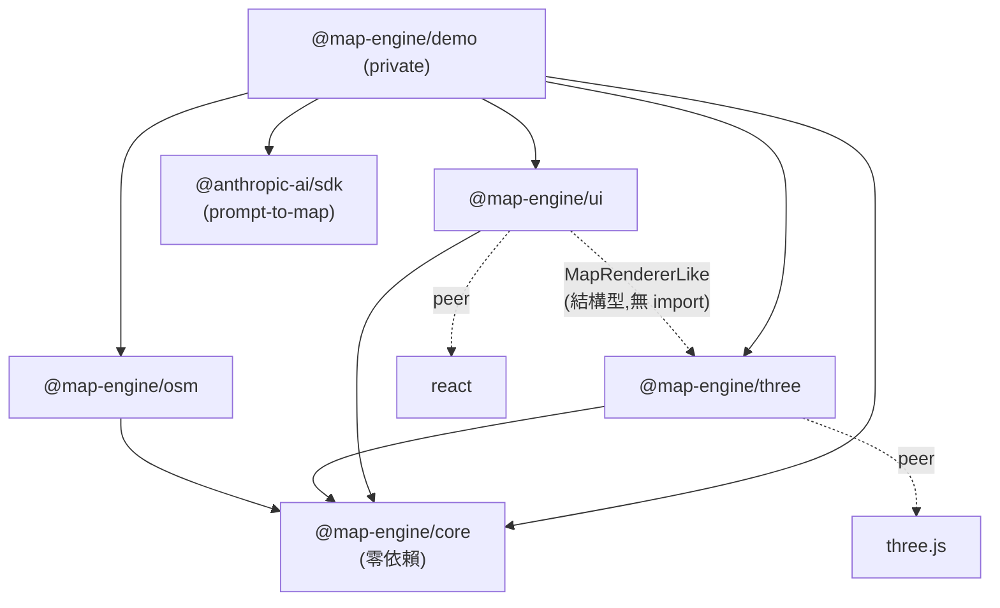

# 3D Map Engine 開發交接文檔

> 交接對象:後續接手的 AI Agent / 開發者
> 撰寫依據:2026-07-05 從零構建整個引擎的實際開發過程(git 歷史逐 commit 對應)
> 原始需求文檔:`3D Map Engine Plan.zip` 內的 `3d-map-engine-plan-v2-zh-Hant.md`(在 repo 根目錄,已 gitignore)
> Live demo:https://gordonlinghk.github.io/3d-map-engine/
> Repo:https://github.com/gordonlinghk/3d-map-engine

---

## 1. 專案背景與目標

### 1.1 用途

一個**可重用的程序生成 3D 城市地圖引擎**(Web / Three.js / TypeScript),不是遊戲、不是 GIS。產出形式:

- 可嵌入其他 Web 應用或遊戲原型的 **SDK**(monorepo 內以 `workspace:*` 消費;npm 發佈基建已就緒但**刻意擱置**,見 §7.4)
- 一個可在瀏覽器操作的 **3D city atlas demo**(GitHub Pages 自動部署)
- 可序列化/反序列化的**地圖資料格式**(JSON-safe)

### 1.2 核心功能範圍(全部已實作)

| 功能塊 | 內容 |
|---|---|
| 程序生成 | seed 決定一切;3 個 preset(coastal-tech-city / island-city / downtown-night-grid);地形、道路網、~2000 棟建築、地標、樹木 |
| 互動 | Orbit / Fly / Walk 三相機模式(Walk 含建築碰撞)、raycast 選取、hover/selected 高亮、focus 飛行 |
| Demo UI | 模糊搜尋(⌘K)、公司/地標列表 + 分類 chips、資訊面板、工具列、迷你地圖、FPS/指南針 HUD |
| 環境 | Day / Golden Hour / Night(含 shadow mapping、夜間發光窗、街燈、星空)、Tour 自動巡覽、圖層開關 |
| 模擬層 | ~150 架車沿道路圖行駛、渡輪往返、飛機 |
| Prompt-to-map | 自然語言 → MapDirectives → MapConfig;Claude API(用戶自帶 key)+ 本地關鍵詞解析 fallback |
| OSM 真實城市 | Overpass API 抓取 → MapWorld;4 個城市預設(中環/澀谷/曼哈頓中城/倫敦金融城) |
| 編輯器 | 拖曳移動、樓高、旋轉、增刪建築、undo/redo、localStorage 持久化、匯出 JSON |

### 1.3 接手前必須理解的前提(硬性規則)

1. **`@map-engine/core` 絕對不可依賴 Three.js、React 或 DOM。** 它只有純資料與生成邏輯。這是整個架構的地基。
2. **所有程序生成必須 deterministic**:同 seed + config 永遠產生 byte 級相同的世界。任何生成路徑禁止用 `Math.random()` / `Date.now()`,一律經 `createRng(seed)` 及其 `fork(label)`。
3. **渲染 mesh 不屬於核心資料模型。** `MapWorld` 只有資料;`@map-engine/three` 負責把資料變成可視物件。
4. **所有可互動物件必須有穩定 `id` + metadata**(建築 id 為格網座標式 `bldg:{i},{j}:{li},{lj}`,OSM 為 `bldg:osm:{wayId}`,用戶新增為 `bldg:user:{n}`)。
5. **每完成一個階段都要有可運行 demo + 測試**,優先可操作成果,不做過度抽象。
6. Demo 用**真實公司公開資料**(文字,無 logo)——這是用戶明確授權的決定。

---

## 2. 從零構建的完整步驟

> 以下按實際開發順序(= git commit 順序)。每步的「驗證」欄位是當時實際執行的驗證方式。

### Phase 1:專案骨架

- **目的**:monorepo + 工具鏈 + 空 Three.js 場景,建立「每步皆可驗證」的基礎。
- **做了什麼**:pnpm workspace(`packages/core|three|ui|demo`)、TypeScript project references(`tsconfig.base.json` + 各包 composite tsconfig)、ESLint flat config、Vitest、Playwright(desktop 1440×900 / large 1920×1080 / mobile 390×844 三個 project)、Vite + React demo 顯示空場景 + FPS。
- **關鍵細節**:
  - 各 library package 的 `main`/`exports` **直接指向 `src/index.ts`**——開發期由 Vite/Vitest 直接編譯源碼,無 build step。發佈欄位由 `publishConfig` 在 pack 時替換(見 B8)。
  - pnpm 11 會攔截依賴的 build scripts:`pnpm-workspace.yaml` 需要 `allowBuilds: { esbuild: true }`。
- **易錯點**:此環境的 preview 面板(corepack 路徑)可能 EPERM,視覺驗證一律走 Playwright 截圖腳本(見 §5.6)。
- **驗證**:`pnpm typecheck && pnpm lint && pnpm build`;e2e `smoke.spec.ts`(FPS 非零、canvas 可見)。

### Phase 2:核心資料與 seeded 生成

- **目的**:確立 determinism 地基。
- **做了什麼**:`core/src/rng.ts`(mulberry32 + xmur3 字串雜湊)、`noise.ts`(value noise + fBm,純函數)、`types.ts`(全部核心型別)、`presets.ts`、`serialize.ts`(版本檢查 + `structuredClone` 隔離)。
- **關鍵細節**:**`rng.fork(label)` 是順序無關的**——`fork('chunk/3,-2')` 的流只取決於 (seed, label),不受父流已消費多少影響。這是「chunk 生成不依賴順序」的實現機制。
- **驗證**:單元測試——同 seed 同序列、fork 順序無關性、序列化 roundtrip 深比較、JSON stringify/parse 存活。

### Phase 3:地形、水域與道路

- **目的**:第一個可看的世界。
- **做了什麼**:`core/terrain.ts`(`createHeightSampler`:fBm + 各 preset 的大尺度遮罩——coastal 用對角線大陸遮罩 + 海灣高斯挖除 + 灣中島嶼高斯凸起;island 徑向衰減;downtown 平台)、`core/roads.ts`(市區格網 + 跨圖高速線,水上段自動成 `bridge`,並有 per-preset 跨灣線)、`core/world.ts`(`generateWorld`/`generateChunk`,chunk 32 分辨率高度網格)、`three/terrainMesh.ts`(高度帶頂點色 + flatShading)、`waterMesh.ts`、`roadMesh.ts`(quad strip 沿地形,merged geometry)。
- **易錯點(實際踩過)**:
  - **道路三角形繞向錯誤 → 面朝下被 backface culling 整批剔除**,看起來像「道路完全不渲染」。修正繞向並加 `side: DoubleSide` 保險。
  - 深海角落 chunk 的高度被 clamp 成常數,「不同 seed 地形不同」的測試必須比較**中央** chunk。
  - 道路格網範圍與街區範圍必須同源:`cityGridExtent(config)`(roads.ts 導出,city.ts 引用)。
- **驗證**:單元測試(land ratio、road graph 連通、序列化)+ 三個 preset 俯視截圖逐一目檢。

### Phase 4:建築與地標

- **做了什麼**:`core/companies.ts`(28 家真實 SF 公司資料)、`core/city.ts`(街區分類 downtown/commercial/residential/waterfront/park → 分 lot 生成建築 → 高度按離市中心衰減 → 公司分配到最高的辦公樓;地標:金門橋/Alcatraz/Sutro Tower/Coit Tower/Oracle Park/Ferry Building;樹木散佈)、`three/buildingsMesh.ts`(**4 個高度等級各一個 InstancedMesh**,程序生成 CanvasTexture 窗戶貼圖,等級化避免窗戶拉伸)、`treesMesh.ts`(instanced)、`landmarksGroup.ts`(手工低模:吊橋塔+拋物線纜索、三腳電視塔、橢圓球場、鐘樓碼頭、監獄島)。
- **易錯點**:吊橋纜索用 CatmullRom 會過衝成波浪,改**三段 QuadraticBezier**;球場 ExtrudeGeometry 的旋轉/平移順序容易弄反。
- **驗證**:建築數量測試(>1200)、每物件有 id/name/position/type、chunk objectIds 不重複;近景截圖對照參考圖。

### Phase 5:互動控制

- **做了什麼**:`three/cameraRig.ts`(orbit=OrbitControls;fly=drag-look + WASD/QE/Shift + 滾輪調速;walk=pointer lock + 貼地 + focus tween)、`three/interaction.ts`(instanced picking:`instanceId` → id 映射;高亮:hover 環+邊框、selected 脈動雙環)、`three/events.ts`(型別化 emitter),renderer 整合 click/dblclick/Esc/hover 節流。
- **關鍵細節**:**rig 在 `setMode('walk'|'fly')` 時才從 camera quaternion 同步 yaw/pitch**。程式化控制相機朝向必須「先 lookAt、再 setMode」——反過來會被 pointer lock 的合成 pointermove 用舊角度覆蓋(CI 實際踩過,見 §5.5)。
- **驗證**:e2e——WASD 位移、投影座標點擊選樓開面板、Esc 清除、focusObject 飛近地標。

### Phase 6:Demo UI

- **做了什麼**:`@map-engine/ui` 全部元件(SearchBar/SidePanel/InfoPanel/Toolbar/MiniMap/Hud/AtlasUI)+ zustand store + Fuse.js 搜尋。**UI 透過結構型介面 `MapRendererLike` 使用 renderer,不 import three package**(structural typing,`ThreeMapRenderer` 自動滿足)。
- **易錯點**:頁面出現第二個 canvas(迷你地圖)後,所有 e2e 的 `locator('canvas')` 都要 `.first()`。
- **驗證**:e2e——搜尋 Cloudflare/AI/Landmark、chips 過濾、列表點擊同步選取。

### Phase 7:環境模式與巡覽

- **做了什麼**:三種環境的完整光照/霧/天空/水色;夜間窗戶=night CanvasTexture 作 emissiveMap;`three/tour.ts`;浮動 label(`projectToScreen`);圖層開關面板。
- **驗證**:e2e——背景色隨環境改變、tour 移動相機、圖層開關隱藏 group;夜景/黃昏截圖目檢。

### Phase 8:驗收、優化、部署

- **做了什麼**:視覺回歸(canvas 像素變異數 > 閾值)、UI 區塊不重疊檢查、mobile 佈局(側欄預設收起);GitHub Actions:`deploy.yml`(test job:typecheck+lint+unit+e2e desktop/mobile → deploy job:`DEPLOY_BASE=/3d-map-engine/` build → Pages)。
- **易錯點**:Pages 剛啟用時 deploy 可能暫時性失敗(“try again later”);**同一 run 重跑會產生兩個同名 artifact 而再失敗——正確做法是 `gh workflow run` 觸發全新 run**。
- **驗證**:CI 綠 + live URL 截圖。

### 後續迭代(按序):A3 → B9 → C10 → B5 → A2 → A4 → B8 → B7 → B6

| 代號 | 內容 | 關鍵檔案 | 一句話要點 |
|---|---|---|---|
| A3 | 街區著色 | `types.ts`(`CityBlock` 進 `MapWorld.blocks`)、`terrainMesh.ts` | 地形頂點按所屬街區 kind 上色,公園綠塊 |
| B9 | 模擬層 | `three/simulation.ts` | 車=InstancedMesh 沿 road graph 邊 polyline;路口隨機轉向;渡輪 pier↔island;圖層 id `traffic` |
| C10 | 首頁化 | `Toolbar.tsx`(World 面板)、`App.tsx`(載入畫面)、`index.html`(OG tags) | preset/seed UI、loading overlay、1200×630 OG 圖 |
| B5 | Prompt-to-map | `core/directives.ts`、`demo/promptToMap.ts` | LLM 只輸出 `MapDirectives`,`applyDirectives` clamp;無 key 走本地關鍵詞解析;結果進 URL `cfg`(base64url)/`env` |
| A2 | 視覺質感 | `renderer.ts`(shadow)、`waterMesh.ts`(normal map 動畫)、`streetLights.ts`、`sky.ts` | PCFSoft 2048 shadow map;**quality 機制**(見 §5.2) |
| A4 | Walk 碰撞 | `three/collision.ts`、`cameraRig.ts` | 2D AABB spatial hash(cell 48)、逐軸解算=沿牆滑行、海面阻擋、head bob |
| B8 | npm 基建 | 各包 `tsup.config.ts`/`tsconfig.build.json`/`publishConfig`、`release.yml` | 建置驗證過、**實際發佈擱置**(用戶決定) |
| B7 | OSM | `packages/osm/*`、`buildingsMesh.ts`(多邊形路徑)、`flatAreas.ts` | 見 §6.4 |
| B6 | 編輯器 | `core/edits.ts`、`three/editor.ts`、`ui/EditorPanel.tsx` | 見 §6.5 |

---

## 3. 順序與依賴關係

### 3.1 必要先後順序

```
Phase 1 骨架 → Phase 2 RNG/資料 → Phase 3 地形/道路 → Phase 4 建築/地標
                                        ↘ Phase 5 互動(需要 picking 目標)
Phase 5 → Phase 6 UI(消費 renderer 事件) → Phase 7 環境/巡覽 → Phase 8 部署
```

後續迭代彼此獨立,但 **B7(OSM)依賴 B6 之前不存在的東西是錯覺——實際上 B6(編輯器)反而復用了 B7 建立的多邊形建築渲染路徑**(旋轉後的矩形 footprint 不再軸對齊 → 自動走 poly 管線)。

### 3.2 模組依賴圖



### 3.3 影響後續擴展的設計決策

| 決策 | 影響 |
|---|---|
| `createWorldHeightSampler` 從 **chunk 高度網格雙線性取樣**(B7 改)而非重算地形函數 | 任何來源的世界(程序/OSM/未來高度圖匯入)道路、車流、Walk、地標朝向全部自動正確。**修改地形高度必須改 chunk heights,不能只改 sampler** |
| 建築渲染二分:軸對齊矩形 → InstancedMesh;任意多邊形 → 合併 ExtrudeGeometry + faceRanges picking | 新增建築形狀不用動 picking;但**編輯建築後必須呼叫 `renderer.refreshBuildings()`** |
| UI 用結構型 `MapRendererLike` / `BuildingEditorLike` | 給 renderer/editor 加公開方法時,UI 若要用需同步擴充 `ui/src/types.ts` 的介面 |
| `MapLayerId` 是封閉 union(core/types.ts) | 新圖層要同時改:union、renderer `layerGroups`、ui `TOGGLABLE_LAYERS` + store `layers` 初始值 |
| 世界重生成 = **整頁 URL 導航**(seed/preset/cfg/env/city 參數) | 分享性好、狀態簡單;代價是切換世界必全頁重載。若改成 in-place `loadWorld`,要處理 tour/editor/overlay 的重建 |
| 編輯以 **overlay**(modified/added/deleted)存,不存整個世界 | localStorage 體積小、同 seed 重生成可重放;**改了生成演算法會讓舊 overlay 的 modified 快照與新世界不一致**(快照直接覆蓋,通常可接受) |

### 3.4 改 X 會牽動 Y 速查表

| 想改 | 會牽動 |
|---|---|
| `BuildingInfo` 欄位 | serialize 測試、`buildingsMesh`、`interaction.buildPickableIndex`、`collision`、`ui/entries`、`InfoPanel`、`editor`、OSM convert |
| 地形形狀/preset | `terrain.ts` 遮罩、`world.test.ts` land-ratio 斷言、道路 `isLand` 判定、城市街區可建性、minimap 底圖 |
| 道路圖結構 | `roadMesh`、`simulation`(車)、`streetLights`、OSM convert 的 road 映射 |
| renderer 公開 API | `ThreeMapRenderer` 介面、`ui/types.ts` 的 `MapRendererLike`、demo `__mapEngine` 消費者(e2e 大量使用) |
| 環境模式 | `applyEnvironment`(光/霧/水色)、`buildingsMesh.setNightMode`、`streetLights`、`stars`、`landmarksGroup.userData.setNight`、ui `ENV_ORDER` |

---

## 4. 系統架構

### 4.1 技術棧

TypeScript 5.9 / Three.js 0.180(peer >=0.170)/ React 19 / Vite 7 / pnpm 11 workspace / Zustand 5 / Fuse.js 7 / Vitest 3 / Playwright 1.61 / tsup 8(發佈建置)/ @anthropic-ai/sdk(僅 demo)。

### 4.2 核心資料流

```mermaid
flowchart LR
  subgraph 來源
    P[preset + seed] --> G[generateWorld]
    NL[自然語言 prompt] --> D[MapDirectives<br/>applyDirectives] --> G
    OSM[Overpass API] --> C[osmToWorld]
  end
  G --> W[(MapWorld<br/>純資料)]
  C --> W
  OV[EditOverlay<br/>localStorage] -- applyEditOverlay --> W
  W --> R[ThreeMapRenderer.loadWorld]
  R --> L["layer groups:<br/>terrain/water/roads/buildings/<br/>trees/landmarks/traffic/stars"]
  R -- events --> UI[AtlasUI (React+zustand)]
  UI -- setSelected/focusObject/setEnvironment --> R
  ED[BuildingEditor] -- 修改 --> W
  ED -- refreshBuildings --> R
```

### 4.3 renderer 內部分工(`three/src/`)

| 模組 | 職責 |
|---|---|
| `renderer.ts` | 組裝一切:場景/光/霧、frame loop、環境切換、圖層、事件 emitter、公開 API(`loadWorld/pickObject/pickGround/focusObject/setSelected/refreshBuildings/projectToScreen/...`) |
| `cameraRig.ts` | 三模式相機 + focus tween + 鍵盤狀態 + 碰撞注入點 |
| `interaction.ts` | raycast picking(instanced + faceRanges)、hover/selected 高亮物件 |
| `collision.ts` | 純 TS 空間雜湊 AABB(可 node 單測) |
| `*Mesh.ts / *Group.ts / simulation.ts / sky.ts / flatAreas.ts` | 各圖層的幾何構建,皆為 `(world) => Object3D` 純構建函數 |
| `editor.ts` | 命令堆疊 + 拖曳 + overlay 追蹤 |
| `tour.ts` | 地標巡覽 |

---

## 5. 開發注意事項

### 5.1 效能

- 建築/樹/車全部 instancing;多邊形建築合併為單一 geometry(單 draw call)。
- `loadWorld` / `refreshBuildings` 會 dispose 舊 geometry/material/texture(`disposeObject` 遍歷含 texture)。新增持有 GPU 資源的模組時**必須**接入 dispose 鏈。
- Shadow map 是最大 GPU 成本(場景每幀多渲染一次)。用戶真機確認 60fps 無壓力;低端裝置可走 quality 'low'。

### 5.2 quality 機制(重要)

`createThreeMapRenderer({ quality: 'high'|'low' })`:low = 無陰影 + pixelRatio 1。Demo 判定:URL `?q=` 覆蓋 → 否則 `navigator.webdriver` 為 true 走 low。**起因:CI 軟件渲染跑 shadow pass 會卡死主線程,UI 互動全部超時。** 任何 headless 截圖想看陰影必須帶 `?q=high`。

### 5.3 3D 座標與幾何慣例

- 世界原點在地圖中心;北 = -Z(OSM 投影 `y = -(lat-lat0)*111320` 與 minimap/指南針一致)。
- `Vec2.y` 在 footprint/boundary 語境代表**世界 Z**。
- Shape/Extrude 幾何:shape 用 `(x, -z)`,`rotateX(-PI/2)` 後 depth 變 +Y。
- 道路抬升 0.35 防 z-fighting;橋面 = waterLevel + 7;flat water/green 多邊形 +0.12/+0.06。
- 新 mesh 記得繞向(頂面朝上)或 `DoubleSide`——Phase 3 的道路隱形就是繞向反了。

### 5.4 資料結構與擴展

- 改 `MapWorld` 型別:優先加**可選欄位**(如 `waterPolygons?`),序列化自動相容;`SERIALIZATION_VERSION` 只在破壞性變更時 bump。
- 手工構造 `MapWorld` 的測試 fixture(serialize.test / collision.test)在加**必填**欄位時會編譯失敗——這是刻意的提醒。

### 5.5 常見 bug 與排查(全部實際發生過)

| 症狀 | 原因 / 修法 |
|---|---|
| 某 mesh 完全看不到但資料正常 | 三角形繞向 → 被 culling。查 winding 或暫時 `DoubleSide` |
| CI e2e 大面積超時、本地全過 | CI 軟渲染 + shadow → 用 quality 機制;已設 `retries: 2` + 120s timeout(playwright.config) |
| walk/fly 測試裡相機亂走 | headless pointer lock 行為不一:**先 lookAt 再 setCameraMode**,測試不要點 canvas(會觸發 pointer lock) |
| tsup `--dts` 報 TS6307 | composite tsconfig 衝突 → 各包有獨立 `tsconfig.build.json`(無 composite),tsup 指向它 |
| Pages deploy “try again later” / 兩個同名 artifact | 前者暫時性;重跑要用 `gh workflow run` 開新 run,不要 rerun --failed |
| e2e strict mode violation: 2 canvases | minimap 也是 canvas → `locator('canvas').first()` |
| 工具列蓋住右側面板按鈕 | `.atlas-toolbar.shifted` 邏輯:selectedId **或** editMode 時 right:328px + top:64px |
| headless FPS 只有 4-8 | 軟件渲染假象,不代表真機效能,別按它調優 |

### 5.6 視覺驗證工作流(無 preview 面板環境)

```bash
nohup pnpm --filter @map-engine/demo dev > /dev/null 2>&1 &   # 背景 dev server
# scratchpad 有現成腳本模式:playwright chromium 開 http://localhost:5173/?q=high
# → page.evaluate 擺相機(window.__mapEngine.renderer.camera.position.set)→ screenshot → Read 圖檔目檢
```

`window.__mapEngine = { renderer, world, tour, editor }` 是 demo 掛的除錯/測試鉤子,e2e 大量依賴,**不要移除**。

---

## 6. 後續擴展指南

### 6.1 新增一個程序生成 preset

1. `core/types.ts`:`MapPresetId` union 加名字。
2. `core/presets.ts`:加 `MapConfig`。
3. `core/terrain.ts`:switch 加該 preset 的大尺度遮罩(參考三個現有分支)。
4. (可選)`core/roads.ts` 加跨水線;`core/city.ts` 的 `districtCenterFor` 加市中心位置與地標分支。
5. demo `PRESETS` 陣列、Toolbar `PRESET_OPTIONS` 加項。
6. 驗證:`world.test.ts` 的「每個 preset 有陸有水」迴圈自動覆蓋;截圖目檢。

### 6.2 新增 3D 物件 / 圖層

1. `core/types.ts`:`MapLayerId` union 加 id;若是可互動物件,擴充 `MapObject` union(記得穩定 id)。
2. `three/` 新建 `xxxMesh.ts` 純構建函數;`renderer.loadWorld` 建立、`layerGroups.set`、加入 `worldRoot`、接 dispose。
3. 若可點選:進 `interaction.buildPickableIndex` + picker 目標。
4. `ui/store.ts` `TOGGLABLE_LAYERS` + `layers` 初始值。
5. 有動畫 → 提供 `update(dt)` 或 `userData.tick(t)`,在 renderer loop 呼叫(參考 simulation / water / beacon)。

### 6.3 修改視覺樣式

- 地形配色:`terrainMesh.ts` 高度帶 + `BLOCK_COLORS`;建築:`buildingsMesh.ts` 的 `FACADE_TINTS`/`POLY_TINTS` 與 `makeFacadeTexture`;環境:`renderer.applyEnvironment`;UI:`ui/ui.css` CSS 變數(`--accent` 等)。
- 改視覺後跑 `e2e/visual.spec.ts`(非空白檢查)並截圖對照;目前**沒有** pixel-diff 基線(候選項 C11 未做)。

### 6.4 接入新的資料來源(參考 OSM adapter 全流程)

1. 新 package(複製 `packages/osm` 的 package.json/tsconfig×2/tsup.config 模式),只依賴 core。
2. 寫 `xxxToWorld(data, opts): MapWorld`:投影到以中心為原點的米制座標、建 chunk 高度網格(有高程就填真值,沒有就平地)、建築 footprint 多邊形(多邊形自動走 extrude 管線)、道路映射成 RoadGraph(共享節點 id = 路口連通)、`waterPolygons`/`greenPolygons` 可選欄位。
3. 純轉換必須配 fixture 單元測試;網路抓取在 e2e 用 `page.route()` mock。
4. demo:載入入口 + loading 文案 + 署名(OSM 要求 attribution,新來源看其授權)。
5. **OSM v1 已知限制**(v2 候選):平地無高程、不處理 multipolygon relations、海岸線海面未重建(維港不顯示)。

### 6.5 擴充編輯器

- 新操作 = 一個 `Command`(apply/revert 成對),經 `commit()` 進歷史;改既有建築用 `mutateCommand` 快照包裝即可。
- 新增可編輯屬性:`three/editor.ts` 加方法 → `ui/types.ts` `BuildingEditorLike` 同步 → `EditorPanel` 加控件。
- 若編輯**非建築**物件(道路/地標):目前 overlay 模型只覆蓋建築,需擴充 `core/edits.ts` 的 `EditOverlay` 並 bump 其 `version`。

### 6.6 安全重構守則

1. 動 core 前先跑 `pnpm test`——determinism 測試是最敏感的警報器。
2. 動 renderer 公開 API:同步 `ThreeMapRenderer` 介面 + `MapRendererLike` + 檢查 e2e 對 `__mapEngine` 的使用。
3. 任何 UI 佈局改動跑 `visual.spec.ts` 的不重疊檢查(desktop+mobile)。
4. 全綠標準:`pnpm typecheck && pnpm lint && pnpm test && npx playwright test`(desktop+mobile ≈ 4-6 分鐘)。

---

## 7. AI Agent 交接清單

### 7.1 接手前先讀(按序)

1. 本文件
2. `README.md`(對外文檔:安裝、控制、SDK 用法、架構筆記)
3. 原始需求 `3d-map-engine-plan-v2-zh-Hant.md`(§13「給 AI Agent 的實作要求」仍然有效)
4. `packages/core/src/types.ts`(整個系統的詞彙表)
5. `packages/three/src/renderer.ts`(所有東西的組裝點)
6. `git log --oneline`(每個 commit 對應一個階段,訊息即變更說明)

### 7.2 動手前檢查

- [ ] `pnpm install && pnpm typecheck && pnpm lint && pnpm test` 全綠(基線 47 unit)
- [ ] `npx playwright install chromium`(首次)後 `npx playwright test --project=desktop` 全綠(基線 22+1skip)
- [ ] 確認要改的部分在 §3.4 速查表中會牽動誰
- [ ] 若改生成邏輯:想清楚舊 `EditOverlay`(localStorage)與舊分享 URL(cfg/seed)是否仍能載入

### 7.3 完成後驗證(每個階段的 Definition of Done)

- [ ] `pnpm typecheck && pnpm lint && pnpm test`
- [ ] 相關 e2e + 必要時新增 e2e(interaction/ui/environment/visual/world/prompt/osm/walk/editor 九個 spec 檔可參考模式)
- [ ] Playwright 截圖目檢(帶 `?q=high` 看陰影)
- [ ] commit(訊息含階段說明)→ push → **等 CI 綠**(`gh run watch`)→ 若部署有變化,實測 live URL
- [ ] 有踩坑或新慣例 → 回寫本文件

### 7.4 待確認 / 懸置事項

| 事項 | 狀態 |
|---|---|
| npm 實際發佈 | **用戶決定擱置**。基建全備:`npm login` + `pnpm release`,或設 `NPM_TOKEN` secret + push `v*` tag。`@map-engine` scope 當時查為未發佈(404),但 npm org 歸屬**待確認**,403 時 fallback 為改名 |
| Prompt-to-map 的 Claude API 真實呼叫 | 代碼完成,本地解析路徑有 e2e;**API 路徑未實測**(開發機無 Anthropic 憑證)。用戶帶 key 實測若報錯,檢查 `output_config.format` schema 相容性 |
| 真機效能基線 | 用戶確認「無卡頓」(含 shadow),但無量化 FPS 數據 |
| C11 視覺 pixel-diff 基線 | 未做(候選項) |
| OSM v2(高程/multipolygon/海岸線) | 未做(候選項) |
| Playwright large viewport project | 存在但 CI 只跑 desktop+mobile |

---

*本文件由構建該引擎的 AI Agent(Claude)於 2026-07-05 撰寫,內容與 git 歷史一一對應。*
